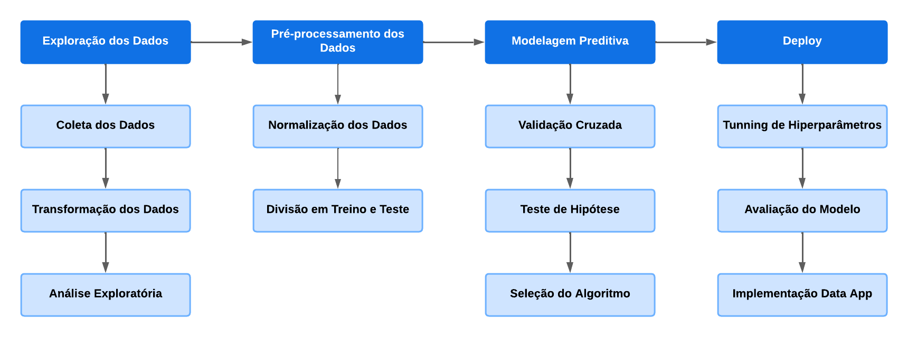
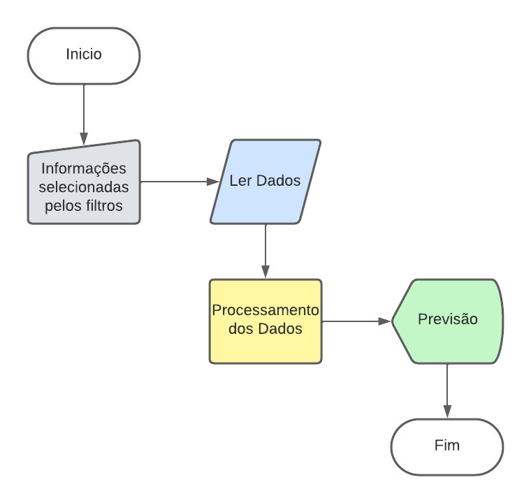

# Análises e Previsões de Aluguel de Casas no Brasil

### Veja a análise completa desse projeto em [Análise e Previsões de Alugueis no Brasil](https://sites.google.com/view/portflio-wiliams-alves/in%C3%ADcio/previs%C3%A3o-de-alugueis?authuser=0).

## Objetivo
objetivo deste projeto é desenvolver um modelo de machine learning de regressão capaz de prever com precisão os preços de aluguéis em cinco cidades brasileiras que são Belo Horizonte, Campinas, Porto Alegre, Rio de Janeiro e São Paulo. O escopo do projeto abrange a implementação desse modelo em um aplicativo de dados, proporcionando aos usuários uma ferramenta prática para estimar os custos de aluguel com base em diferentes características imobiliárias.

## Sobre a Base de Dados Usada no Projeto
A base de dados usada foi o dataset [brasilian-house-to-rent](https://www.kaggle.com/datasets/rubenssjr/brasilian-houses-to-rent?select=houses_to_rent_v2.csv) que esta disponível na plataforma [kaggle.com](https://www.kaggle.com/).
O dados são referente a imóveis para alugar em 2020, o dataset possui 10.962 registros com 13 variáveis diferentes, foram realizados processos para limpeza dos dados e tratamento de outliers.

## Arquivos do Projeto
1. [Jupyter Notebook do Projeto](./Analise_Previsao_Aluguel_Brasil.ipynb)
2. [Código do Data App](./app.py)
3. [Datasets Usados](./dados/)
4. [Modelo de Regressão](./modelo/)
5. [Gráficos e Imagens](./img/)

## Data App
> Clique na imagem abaixo para abrir o data app.

[](https://previsao-alugueis-brasil.streamlit.app/)

## Contextualização do Problema de Negócio
### Cenário
Uma imobiliária chamada Brazil Rent que opera em cinco cidades brasileiras, que são, Belo Horizonte, Campinas, Porto Alegre, Rio de Janeiro e São Paulo, deseja otimizar a precificação de aluguéis para seus clientes. Atualmente, a empresa enfrenta desafios na definição de preços competitivos e justos para os diferentes imóveis que gerencia em cada cidade. A falta de um sistema de precificação eficiente resulta em inconsistências nos valores de aluguel, levando a perdas financeiras e insatisfação entre proprietários e inquilinos.
### Problema de Negócio
A empresa enfrenta dificuldades em estabelecer preços de aluguéis que reflitam de maneira precisa as características únicas de cada imóvel e as condições específicas do mercado em cada cidade. A abordagem atual baseia-se em avaliações subjetivas, o que leva a variações nos preços que não são necessariamente justificadas por fatores objetivos. Isso resulta em imóveis que podem estar subvalorizados, prejudicando a rentabilidade da imobiliária, ou superavaliados, o que pode afetar a atração de inquilinos.
### Proposta de Solução
Implementação de um modelo de machine learning de regressão em um data app, para prever preços de aluguéis visando resolver o problema de negócio enfrentado pela imobiliária, proporcionando uma abordagem mais eficiente e precisa na precificação de seus imóveis.

## Passos Principais do Projeto
Para inciar o projeto foi definido o fluxo de trabalho visando a organização das tarefas, abaixo apresento o fluxo implementado no projeto.



### Ferramentas Usadas
Neste projeto foi usada as ferramentas:
- Python: por ser uma linguagem que da grande suporte para análise de dados e machine learning.
- Jupyter Notebook: IDE que possibilita a organização do código em celulas, isso ajuda nas várias etapas do projeto.
- Bibliotecas: PySpark, Pandas, Numpy, Matplotlib, Seaborn, Scipy, SKlearn, Statsmodels, Streamlit e Folium.

## 1. Exploração dos Dados
<details>
<summary><b>1.1 Carregando a Base de Dados</b></summary>

```
# Carregando base de dados usando Spark
base = './dados/houses_to_rent_v2.csv'
df = spark.read.csv(base, header=True, inferSchema=False)
```
</details>
<details>
<summary><b>1.2 Transformação dos Dados</b></summary>

```
# Alterando título das colunas do dataset
novo_titulo = [
    'cidade', 'area', 'quartos', 'banheiros', 'vagas', 'andar', 'animais',
    'mobilia', 'condominio', 'aluguel', 'iptu', 'seguro', 'total'
]
for indice, coluna in enumerate(df.columns):
    df = df.withColumnRenamed(coluna , novo_titulo[indice])

# Alterando atributo da coluna 'animal'
# not acept iremos alterar para 0
# acept iremos alterar para 1
df = df.withColumn('animais', when(col('animais') == 'not acept',0).otherwise(col('animais')))\
    .withColumn('animais', when(col('animais') == 'acept',1).otherwise(col('animais')))

# Alterando atributo da coluna 'mobilia'
# not furnished iremos alterar para 0
# furnished iremos alterar para 1
df = df.withColumn('mobilia', when(col('mobilia') == 'not furnished',0).otherwise(col('mobilia')))\
    .withColumn('mobilia', when(col('mobilia') == 'furnished',1).otherwise(col('mobilia')))

# Alterando valoe '-' para 0 na coluna andar
df = df.withColumn('andar', when(col('andar') == '-', 0).otherwise(col('andar')))

def converte_dados(dados):
    '''Converte o tipo dos dados das colunas numéricas.'''
    for coluna in dados.columns[1:8]:
        dados = dados.withColumn(coluna, col(coluna).cast('int'))

    for coluna in dados.columns[8:]:
        dados = dados.withColumn(coluna, col(coluna).cast('float'))
    
    return dados

# Convertendo as colunas string em int e float
df = converte_dados(df)

# Removendo registros duplicados
df = df.dropDuplicates()

# Removendo outliers apartir dos limites superiores de cada coluna
df_tratado = df.filter((col('area') <= 500) & (col('quartos') <= 5) & (col('banheiros') <= 6) & (col('vagas') <= 4)\
                      & (col('andar') <= 20) & (col('condominio') <= 2800.0) & (col('aluguel') <= 10175.0)\
                      & (col('iptu') <= 877.5) & (col('seguro') <= 136.0) & (col('total') <= 13636.0))

```
</details>

### 1.3 Análise Exploratória

<details>
<summary><b>1.3.1 Correlação Entre as Variáveis da Base de Dados</b></summary>

```
df = dados.toPandas().drop(df.columns[0], axis=1)
plt.figure(figsize=(10,6))
sns.heatmap(df.corr(), cmap=sns.color_palette('Blues'), linewidths=.2, annot=True, fmt='.2f')
plt.title('Mapa de Correlação')

plt.savefig('./img/graficos/correlacao.png', format='png')
plt.show()
```
</details>
<details>
<summary><b>1.3.2 Relação entre Área e Aluguel</b></summary>

```
df = dados.select('area', 'aluguel').toPandas().groupby('area')['aluguel'].mean().reset_index()
plt.figure(figsize=(8,4))
sns.regplot(df, x='aluguel', y='area', ci=None, fit_reg=True, color='orange',
            scatter_kws={'color': sns.color_palette('dark:b', n_colors=len(df['area']))})
plt.title('Relação Entre Area do Imóvel e Preço do Aluguel')
plt.xlabel('Alugueis')
plt.ylabel('Área m²')

plt.savefig('./img/graficos/area_aluguel.png', format='png')
plt.show()
```
</details>
<details>
<summary><b>1.3.3 Efeito da Localização Geográfica no Tamanho da Área do Imóvel</b></summary>

```
df = dados.select('cidade','area').toPandas().groupby('cidade')['area'].mean().reset_index()
plt.figure(figsize=(8,4))
ax = sns.barplot(df, x='cidade', y='area', palette='viridis')
ax.bar_label(ax.containers[0], fontsize=9)
plt.title('Área Média de Imóveis Por Cidade')
plt.xlabel('Cidades')
plt.ylabel('Área Média m²')

plt.savefig('./img/graficos/area_cidade.png', format='png')
plt.show()
```
</details>
<details>
<summary><b>1.3.4 Impacto da Localização no Aluguel</b></summary>

```
df = dados.select('cidade','aluguel').toPandas().groupby('cidade')['aluguel'].mean().reset_index()
plt.figure(figsize=(8,4))
ax = sns.barplot(df, x='cidade', y='aluguel', palette='viridis')
ax.bar_label(ax.containers[0], fontsize=10)
plt.title('Média de Alugueis Por Cidade')
plt.ylabel('Média de Alugueis')

plt.savefig('./img/graficos/aluguel_cidade.png', format='png')
plt.show()
```
</details>
<details>
<summary><b>1.3.5  Influência do Número de Quartos e Banheiros no Aluguel</b></summary>

```
df = dados.select('quartos','banheiros','aluguel').withColumn('comodos', col('quartos') + col('banheiros'))\
    .select('comodos','aluguel').toPandas().groupby('comodos')['aluguel'].mean().reset_index()
plt.figure(figsize=(8,4))
sns.regplot(df, x='comodos', y='aluguel', ci=None, fit_reg=True, color='r',
            scatter_kws={'color': sns.color_palette('dark:b', n_colors=len(df['aluguel']))})
plt.title('Influência da Quantidade de Quartos e Banheiros no Aluguel')
plt.xlabel('Total de Quartos e Banheiros')
plt.ylabel('Média de Aluguel')

plt.savefig('./img/graficos/comodos_aluguel.png', format='png')
plt.show()
```
</details>
<details>
<summary><b>1.3.6 Andar e Valor do Aluguel</b></summary>

```
df = dados.select('andar','aluguel').toPandas()
bins = [0, 5, 10, 15, 20]
labels = ['0-5', '6-10', '11-15', '16-20']
df['faixa_andar'] = pd.cut(df['andar'], bins=bins, labels=labels, right=False)
df = df.groupby('faixa_andar')['aluguel'].mean().reset_index()

plt.figure(figsize=(8,4))
ax = sns.barplot(df, x='faixa_andar', y='aluguel', palette='viridis')
ax.bar_label(ax.containers[0], fontsize=9)
plt.title('Influência do Andar no Aluguel')
plt.xlabel('Andares')
plt.ylabel('Média de Aluguel')

plt.savefig('./img/graficos/andar_aluguel.png', format='png')
plt.show()
```
</details>
<details>
<summary><b>1.3.7 Andar e Valor do Condomínio</b></summary>

```
df = dados.select('andar','condominio').toPandas()
bins = [0, 5, 10, 15, 20]
labels = ['0-5', '6-10', '11-15', '16-20']
df['faixa_andar'] = pd.cut(df['andar'], bins=bins, labels=labels, right=False)
df = df.groupby('faixa_andar')['condominio'].mean().reset_index()

plt.figure(figsize=(8,4))
ax = sns.barplot(df, x='faixa_andar', y='condominio', palette='viridis')
ax.bar_label(ax.containers[0], fontsize=9)
plt.title('Influência do Andar no Valor do Condomínio')
plt.xlabel('Andares')
plt.ylabel('Média de Condomínio')

plt.savefig('./img/graficos/andar_condominio.png', format='png')
plt.show()
```
</details>
<details>
<summary><b>1.3.8 Aceitação de Animais com o Valor do Aluguel e Condomínio</b></summary>

```
df = dados.select('animais','aluguel').toPandas()
df.animais = df.animais.replace([0,1],['Não aceita animais', 'Aceita animais'])
plt.figure(figsize=(6, 4))
sns.boxplot(df, x='aluguel', y='animais', palette='viridis', whis=3)
plt.title('Distribuição do Aluguel com e sem Animais')
plt.ylabel('')
plt.xlabel('Valor do Aluguel')

plt.savefig('./img/graficos/animais_aluguel.png', format='png')
plt.show()
```
```
df = dados.select('animais','condominio').toPandas().groupby('animais')['condominio'].mean().reset_index()
df.animais = df.animais.replace([0,1],['Não aceita animais', 'Aceita Animais'])
plt.figure(figsize=(8,6))
ax = sns.barplot(df, x='animais', y='condominio', errorbar=None, palette='viridis')
ax.bar_label(ax.containers[0], fontsize=9)
plt.title('Aceitação de Animais com o Valor de Condomínio')
plt.xlabel('Aceita ou Não Animais')
plt.ylabel('Média de Condomínio')

plt.savefig('./img/graficos/animais_condominio')
plt.show()
```
</details>
<details>
<summary><b>1.3.9 Imóveis com Mobilia Influênciam no Valor do Aluguel</b></summary>

```
df = dados.select('mobilia','aluguel').toPandas()
df.mobilia = df.mobilia.replace([0,1],['Sem mobilia','Com mobilia'])
plt.figure(figsize=(6, 4))
sns.boxplot(df, x='aluguel', y='mobilia', palette='viridis', whis=3)
plt.title('Distribuição do Aluguel com e sem Mobilia')
plt.ylabel('')
plt.xlabel('Valor do Aluguel')

plt.savefig('./img/graficos/mobilia_aluguel.png', format='png')
plt.show()
```
</details>
<details>
<summary><b>1.3.10 Custo Adicional de Vagas de Estacionamento</b></summary>

```
df = dados.select('vagas','aluguel').toPandas().groupby('vagas')['aluguel'].mean().reset_index()
plt.figure(figsize=(8,4))
ax = sns.barplot(df, x='vagas', y='aluguel', palette='viridis')
ax.bar_label(ax.containers[0], fontsize=9)
plt.title('Média de Valores de Aluguel pela Quantidade de Vagas de Estacionamento')
plt.xlabel('Quantidade de Vagas de Estacionamento')
plt.ylabel('Média de Aluguel')

plt.savefig('./img/graficos/vaga_aluguel.png', format='png')
plt.show()
```
</details>
<details>
<summary><b>1.3.11 Correlação entre Condomínio e IPTU</b></summary>

```
df = dados.select('condominio','iptu').toPandas().groupby('condominio')['iptu'].mean().reset_index()
plt.figure(figsize=(8,4))
sns.regplot(df, x='condominio', y='iptu', ci=None, fit_reg=True, color='r',
            scatter_kws={'color': sns.color_palette('light:g', n_colors=len(df['condominio']))})
plt.title('Correlação Entre o Valor do Condomínio e IPTU')
plt.ylabel('IPTU')
plt.xlabel('Valor Condomínio')

plt.savefig('./img/graficos/condominio_iptu.png', format='png')
plt.show()
```
</details>
<details>
<summary><b>1.3.12 A Taxa de Seguro Influencia no Aluguel</b></summary>

```
df = dados.select('aluguel','seguro').toPandas().groupby('aluguel')['seguro'].mean().reset_index()
plt.figure(figsize=(8,4))
sns.regplot(df, x='aluguel', y='seguro', ci=None, fit_reg=True, color='g',
           scatter_kws={'color':sns.color_palette('light:r', n_colors=len(df['seguro']))})
plt.title('Relação Entre os Valores de Seguro e Aluguel')
plt.xlabel('Valor do Aluguel')
plt.ylabel('Valor do Seguro')

plt.savefig('./img/graficos/seguro_aluguel.png', format='png')
plt.show()
```
</details>

## 2. Pré-processamento dos Dados

<details>
<summary><b>2.1 Normalização dos Dados</b></summary>

```
# Separando variáveis preditoras e variável alvo
X = dados.toPandas().drop(['aluguel','total'], axis=1)
y = dados.select('aluguel').toPandas()

# Definindo variáveis com features numéricas e categóricas
variavel_num = ['area','quartos','banheiros','vagas','andar','animais',
                    'mobilia','condominio','iptu','seguro']
variavel_cat = ['cidade']

# Definido transformações com estimador final
num_transformer = Pipeline(steps=[('scaler', StandardScaler())])
cat_transformer = Pipeline(steps=[('onehot', OneHotEncoder())])

# Criando o pré-processador
preprocessor = ColumnTransformer(
    transformers=[
        ('num', num_transformer, variavel_num),
        ('cat', cat_transformer, variavel_cat)
    ])

# Aplicando o pré-processamento
X_processed = preprocessor.fit_transform(X)
```
</details>
<details>
<summary><b>2.2 Divisão em Treino e Teste</b></summary>

```
x_treino, x_teste, y_treino, y_teste = train_test_split(X_processed, y, test_size=0.25, random_state=1)
```
</details>

## 3. Modelagem Preditiva

<details>
<summary><b>3.1 Validação Cruzada</b></summary>

```
def validacao_cruzada(modelo, base_x, base_y):
    '''Retorna uma lista de pontuações para cada modelo.'''
    resultados = []

    for i in range(30):
        kfold = KFold(n_splits=5, shuffle=True, random_state=i)
        mae_score = make_scorer(mean_absolute_error, greater_is_better=False)
        scores = cross_val_score(modelo, base_x, base_y, scoring=mae_score, cv=kfold)
        resultados.append(scores.mean())

    return resultados

# Modelos
regressor_linear = LinearRegression()
regressor_forest = RandomForestRegressor()
regressor_svr = SVR()
regressor_mlpr = MLPRegressor()

# Gerando as validações
validacao_regressor_linear = validacao_cruzada(regressor_linear, X_processed, y)
validacao_regressor_forest = validacao_cruzada(regressor_forest, X_processed, y)
validacao_regressor_svr = validacao_cruzada(regressor_svr, X_processed, y)
validacao_regressor_mlpr = validacao_cruzada(regressor_mlpr, X_processed, y)

# Convertendo números negativos em positivos
validacao_regressor_linear = [validacao_regressor_linear[i] * -1 for i in range(30)]
validacao_regressor_forest = [validacao_regressor_forest[i] * -1 for i in range(30)]
validacao_regressor_svr = [validacao_regressor_svr[i] * -1 for i in range(30)]
validacao_regressor_mlpr = [validacao_regressor_mlpr[i] * -1 for i in range(30)]

# Distribuição
fig, axs = plt.subplots(2,2, figsize=(10,8))
sns.kdeplot(validacao_regressor_linear, ax=axs[0,0])
axs[0,0].set_title('MAE Linear Regression')
sns.kdeplot(validacao_regressor_forest, ax=axs[0,1])
axs[0,1].set_title('MAE Random Forest Regression')
sns.kdeplot(validacao_regressor_svr, ax=axs[1,0])
axs[1,0].set_title('MAE SVR')
sns.kdeplot(validacao_regressor_mlpr, ax=axs[1,1])
axs[1,1].set_title('MAE Redes Neurais Artificiais')

plt.savefig('./img/graficos/distribuicao.png', format='png')
plt.show()

```
</details>
<details>
<summary><b>3.2 Teste de Hipótese</b></summary>

```
# Preparando base
lista = [model for model in ['LinearRegression', 'RandomForest',
                             'SVR', 'MLPRegressor'] for _ in range(30)]

resultado_algoritmos = {'MAE':np.concatenate([validacao_regressor_linear, validacao_regressor_forest,
                                                  validacao_regressor_svr, validacao_regressor_mlpr]),
                        'Algoritmo':lista}
resultado_algoritmos = pd.DataFrame(resultado_algoritmos)

# Aplicando teste de multiplas comparações
compara_algoritmos = MultiComparison(resultado_algoritmos['MAE'], resultado_algoritmos['Algoritmo'])

# Teste estatístico
teste_estatistico = compara_algoritmos.tukeyhsd()
print(teste_estatistico)
```
</details>
<details>
<summary><b>3.3 Seleção do Algoritmo</b></summary>

```
# Visualizando o melhor modelo
teste_estatistico.plot_simultaneous()
plt.grid(True)
plt.savefig('./img/graficos/tukey.png', format='png')
plt.show()
```
</details>

## 4. Deploy

<details>
<summary><b>4.1 Tunning de Hiperparâmetros</b></summary>

```
# Hiperparâmetros
parametros = {
    'criterion':['squared_error', 'absolute_error'],
    'n_estimators':[10, 50, 100, 200],
    'min_samples_split':[2, 5, 10],
    'min_samples_leaf':[1, 5, 10]
}

# Criando objeto GridSearchCV
grid_search = GridSearchCV(estimator=RandomForestRegressor(), param_grid=parametros)

# Treinando modelo
grid_search.fit(X_processed, y)

# Melhores hiperparâmetros
melhores_parametros = grid_search.best_params_

# Melhor acurácia
melhor_resultado = grid_search.best_score_

# Visualizando os resultados
print(melhores_parametros)
print(melhor_resultado)

# Criando o modelo
modelo = RandomForestRegressor(n_estimators=200, criterion='squared_error', min_samples_split=10,
                              min_samples_leaf=1, random_state=1)
modelo.fit(x_treino, y_treino)
```
</details>
<details>
<summary><b>4.2 Avaliação do Modelo</b></summary>

```
# Pontuação do modelo com os dados de treino
modelo.score(x_treino, y_treino)

# Pontuação do modelo com os dados de teste
modelo.score(x_teste, y_teste)

# Validação cruzada
tamanho, pontos_treino, pontos_teste = learning_curve(modelo, X_processed, y, cv=10)

# Médias
media_treino = np.mean(pontos_treino, axis=1)
media_teste = np.mean(pontos_teste, axis=1)

# Desvio padrão
std_treino = np.std(pontos_treino, axis=1)
std_teste = np.std(pontos_teste, axis=1)

# Gráfico
plt.figure(figsize=(10, 6))
sns.lineplot(x=tamanho, y=media_treino, label='Treino', marker='o')
sns.lineplot(x=tamanho, y=media_teste, label='Teste', marker='o')
plt.fill_between(tamanho, media_treino - std_treino, media_treino + std_treino, alpha=0.2)
plt.fill_between(tamanho, media_teste - std_teste, media_teste + std_teste, alpha=0.2)

plt.xlabel('Épocas')
plt.ylabel('Desempenho')
plt.title('Curva de Aprendizado')
plt.legend(loc='best')
plt.grid(True)
plt.ticklabel_format(style='plain', axis='y')

plt.savefig('./img/graficos/curva_aprendizado.png', format='png')
plt.show()

# Gerando previsões
previsoes = modelo.predict(x_teste)

# Calculando o MAE (mean_absolut_error)
mean_absolute_error(y_teste, previsoes)

# Preparando dados
resultado = y_teste.copy()
resultado['previsoes'] = previsoes

# Gerando gráfico
plt.figure(figsize=(8,4))
ax = sns.regplot(resultado, x='aluguel', y='previsoes', color='r',
           scatter_kws={'color':sns.color_palette('light:gray', n_colors=len(resultado['previsoes']))})
plt.legend([ax.get_lines()[0]], ['Previsões'])
plt.title('Gráfico de Previsões do Modelo')
plt.xlabel('Valores Reais')
plt.ylabel('Previsões')

plt.savefig('./img/graficos/avaliacao.png', format='png')
plt.show()
```
</details>

## Implementação Data App
O deploy da aplicação foi realizado na [Streamlit Community Cloud](https://docs.streamlit.io/streamlit-community-cloud), que é uma plataforma aberta e gratuita para a comunidade implementar, descobrir e partilhar aplicações e código Streamlit entre si.

O funcionamento da aplicação segue o fluxograma:



### Benefícios Esperados
- **Precificação Justa**:

    A imobiliária será capaz de estabelecer preços de aluguel mais justos e competitivos, considerando as características específicas de cada imóvel e as nuances do mercado em cada cidade.
- **Redução de Vacâncias**:

    Apreciações precisas podem contribuir para a redução do tempo em que as propriedades ficam desocupadas, melhorando a rentabilidade global da imobiliária.
- **Melhoria na Satisfação do Cliente**:

    Proprietários e inquilinos se beneficiarão de preços mais justos, melhorando a satisfação e a confiança no serviço prestado pela imobiliária.

## Conclusão
Além da eficácia do modelo RandomForestRegressor demonstrados pelos resultados obtidos, a implementação deste modelo em um Data App traz benefícios significativos para a aplicação prática no mercado imobiliário. Aqui estão alguns pontos-chave que destacam as vantagens do aplicativo de dados baseado nesse modelo:

1. **Acessibilidade e Usabilidade:** Ao incorporar o modelo em um Data App, os usuários, que podem incluir corretores imobiliários, proprietários e inquilinos, têm acesso fácil às previsões de preços de aluguel. A interface intuitiva do aplicativo torna o processo de obtenção de estimativas de aluguel mais acessível, mesmo para aqueles sem conhecimento técnico em machine learning.

2. **Tomada de Decisão Informada:** O aplicativo oferece uma ferramenta valiosa para a tomada de decisões informadas no mercado imobiliário. Proprietários podem ajustar seus preços de aluguel com base em previsões precisas, corretores podem aprimorar suas estratégias de negociação, e inquilinos podem realizar comparações e tomar decisões mais conscientes.

3. **Agilidade nas Atualizações de Preços:** Com a implementação do modelo em um aplicativo, a imobiliária pode ajustar rapidamente os preços de aluguel em resposta a mudanças nas condições do mercado. Isso garante que a empresa permaneça competitiva e reativa às flutuações no cenário imobiliário.

4. **Feedback em Tempo Real:** O Data App pode fornecer feedback em tempo real sobre as previsões de aluguel, permitindo a análise contínua do desempenho do modelo. Isso possibilita ajustes e melhorias contínuas para garantir que o modelo esteja alinhado com as condições dinâmicas do mercado.

5. **Facilidade de Integração com Outros Sistemas:** A implementação em um aplicativo facilita a integração do modelo com outros sistemas internos da imobiliária, como plataformas de gestão de propriedades e sistemas de atendimento ao cliente. Isso contribui para uma operação mais eficiente e coesa.

6. **Expansão para Novas Localidades:** Caso a imobiliária deseje expandir seus serviços para outras cidades, o modelo e o aplicativo podem ser adaptados para incluir novos dados e características específicas de cada localidade, garantindo uma abordagem personalizada e precisa.

Em conclusão, a implementação do modelo RandomForestRegressor em um Data App não apenas valida sua eficácia, mas também oferece uma solução prática e acessível para as partes interessadas no mercado imobiliário. A combinação de um modelo robusto com a facilidade de uso proporcionada pelo aplicativo cria uma ferramenta valiosa para otimizar processos e melhorar a tomada de decisões no setor.
